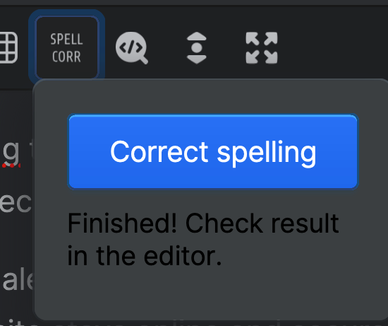

# Statamic Gpt Spell Corrector

> GPT Spell Corrector is a Statamic addon that uses OpenAI to correct spelling mistakes on Bard fields

## Features

This addon will add a button to the Bard editor for spelling correction.



When activation the spell correction it will send the contents of the Bard editor to OpenAI using a pre-configured prompt.
The OpenAI response is then put back into the editor.

## How to Install

``` bash
composer require govigilant/statamic-gpt-spell-corrector
```

As this package uses [openai-php/laravel](https://github.com/openai-php/laravel) you need to configure that package too.
You can do that by running `php artisan openai:install`.

Then add the OpenAI variables to your environment file:
```dotenv
OPENAI_API_KEY=sk-...
OPENAI_ORGANIZATION=org-...
GPT_SPELL_CORRECTOR_MODEL=gpt-4o
```

### Customizing the prompt

If you need to customize the prompt you can overwrite the `prompt` view in this package.

## Vigilant

This package was created for [Vigilant](https://govigilant.io/), an open source all-in-one Website Monitoring tool.
Check out the website or [Github](https://github.com/govigilant). Join the Discord if you have any questions about this package.

## License

The MIT License (MIT). Please see [License File](LICENSE.md) for more information.
